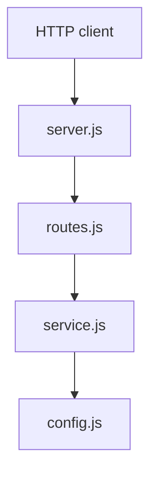

# Architecture Overview

> Generated by Code Explorer on 2026-06-13 at commit `fixture`. Scope: fixtures/tiny-node-api. Mode: initial.

## Confirmed architecture facts

- A single-process HTTP server routes one path to one handler to one service.

## Inferred architecture

- Thin layering: server → router → handler → service → config.

## Main components

| Component | Path(s) | Responsibility | Depends on | Used by | Confidence |
|---|---|---|---|---|---:|
| Server | `src/server.js` | Start HTTP server | routes, config | (entry) | High |
| Router | `src/routes.js` | Dispatch requests | service | server | High |
| Service | `src/service.js` | Build greeting | config | router | High |
| Config | `src/config.js` | Load env config | — | server, service | High |

## High-level diagram

## Architectural patterns

- Layered, CLI-started HTTP server. Confirmed by the call chain.

## Recovered design decisions

| Decision | Status | Evidence | Consequences |
|---|---|---|---|
| Use Node built-in `http` rather than a framework | Inferred | `src/server.js` imports `node:http` | No middleware; routing is manual |

## Architectural risks

- None structural at this size.

## Open architecture questions

- None.

## Limitations

- The fixture is too small to exhibit meaningful architectural pressure.
