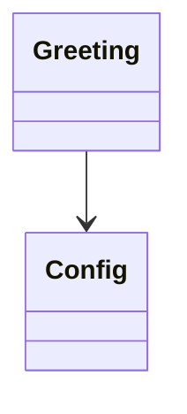

# Domain Model

> Generated by Code Explorer on 2026-06-13 at commit `fixture`. Scope: fixtures/tiny-node-api. Mode: initial.

## Core concepts

| Concept | Meaning | Represented by | Evidence | Confidence |
|---|---|---|---|---:|
| Greeting | A formatted salutation string | `src/service.js` `buildGreeting` | returns `${prefix}, ${who}!` | High |

## Relationships

## Important invariants

| Invariant | Where enforced | Confidence | Evidence |
|---|---|---:|---|
| Empty name falls back to "world" | `src/service.js` | High | `name && name.trim() !== ''` check |

## State transitions

- None; the service is stateless.

## Naming inconsistencies

- None observed.

## Open domain questions

- None.

## Limitations

- The domain is trivially small.
