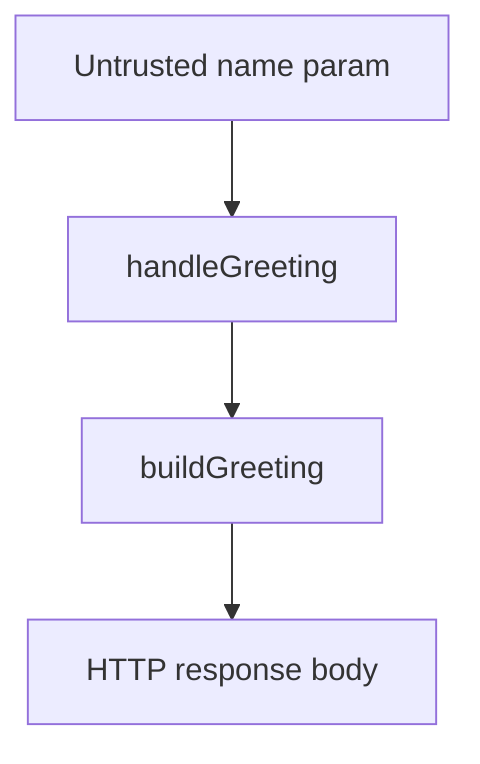

# Data Flows and Trust Boundaries

> Generated by Code Explorer on 2026-06-13 at commit `fixture`. Scope: fixtures/tiny-node-api. Mode: initial.

## Flow: greeting request

### Summary

Untrusted `name` flows from the query string into the response body unchanged.

### Diagram

### Trust boundaries

| Boundary | Data crossing | Validation | Risk |
|---|---|---|---|
| User input -> handler | `name` query param | none | Medium |

### Sources

- `name` query parameter (`src/routes.js`).

### Transformations

- Concatenated into `${prefix}, ${who}!` (`src/service.js`).

### Sinks

- HTTP response body (`res.end(body)` in `src/routes.js`).

### Side effects

- None.

### Failure modes

- None handled explicitly.

### Risks

- RISK-001: reflected output without length limit or sanitization.

### Open questions

- QUESTION-001.

## Limitations

- Only one flow exists.
