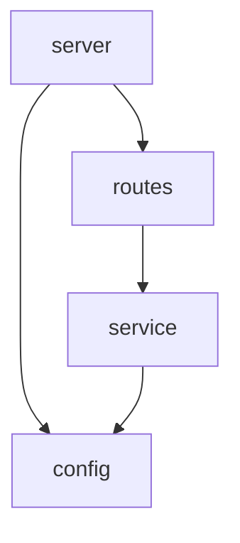

# Dependency Graph

> Generated by Code Explorer on 2026-06-13 at commit `fixture`. Scope: fixtures/tiny-node-api. Mode: initial.

## Module graph

## High fan-in modules

| Module | Used by | Why it matters |
|---|---|---|
| `src/config.js` | server, service | Central config source |

## High fan-out modules

| Module | Depends on | Risk |
|---|---|---|
| `src/server.js` | routes, config | Low |

## Cycles

| Cycle | Risk | Evidence |
|---|---|---|
| (none) | — | No cycles found |

## Cross-layer dependencies

- None.

## Hotspots

- None at this size.

## Limitations

- Graph built from direct imports only.
