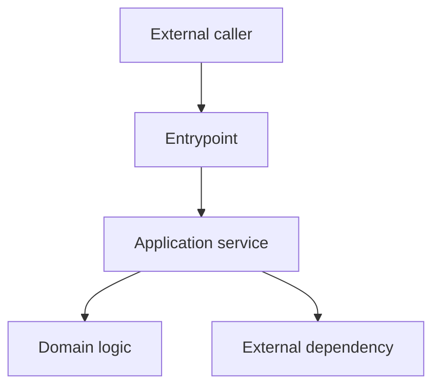
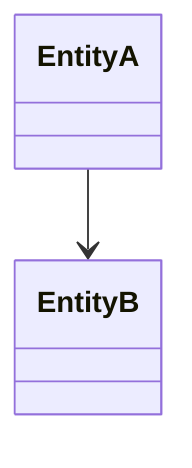
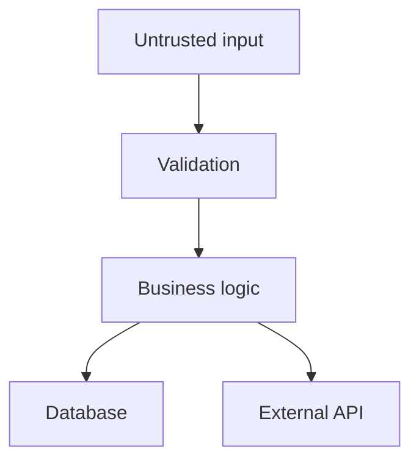

# Output Contracts Reference

This reference defines the artifact layout, Markdown templates, and JSON shapes for all Code Explorer phases. It is a local reference, not an invocable skill. Phase skills must follow these contracts exactly so artifacts stay diffable across refreshes.

The authoritative machine-readable contract is the set of JSON Schemas in `shared/schemas/`. The shapes below are human-readable summaries; when they disagree with a schema, the schema wins. Validate artifacts with `scripts/validate-artifacts.mjs`.

All artifacts carry the provenance stamp defined in `shared/exploration-protocol.md`:

- Markdown artifacts: place the stamp blockquote immediately after the H1 title. The templates below omit it for brevity; always include it.
- JSON artifacts: `"_meta": {}` in the shapes below is shorthand for the full provenance object (`shared/schemas/common.schema.json#/$defs/artifactMeta`), which is required in every JSON file:

```json
{
  "_meta": {
    "schema": "risks",
    "schemaVersion": "1",
    "generatedAt": "2026-06-12T14:00:00Z",
    "generator": "code-explorer",
    "repositoryRoot": ".",
    "commit": "8c4d3ac",
    "scope": ".",
    "mode": "initial",
    "confidence": "high",
    "limitations": []
  }
}
```

`_meta.schema` and `_meta.schemaVersion` are strings and are required. `_meta.mode` is one of `initial|refresh|partial|validation`. JSON payloads live under a `data` key next to `_meta`.

Every `data` item that represents a logical thing carries a stable `id` (`RISK-001`, `ENTRYPOINT-001`, ...) per `shared/stable-id-policy.md`. The exception is `dependency_graph.json`, whose node `id` values are graph-local identifiers, not stable IDs.

Markdown labels (`High`, `Critical`, ...) are capitalized; JSON enum values are lowercase. Every numbered markdown artifact (01-18) ends with a `## Limitations` section, shown in each template; keep it brief when there is nothing to record.

## Directory Layout

```text
docs/codebase-exploration/
  00_EXECUTIVE_SUMMARY.md
  01_REPOSITORY_MAP.md
  02_BUILD_AND_RUNTIME.md
  03_ARCHITECTURE_OVERVIEW.md
  04_ENTRYPOINTS.md
  05_DOMAIN_MODEL.md
  06_DATAFLOWS_AND_TRUST_BOUNDARIES.md
  07_FUNCTION_AND_SYMBOL_INVENTORY.md
  08_DEPENDENCY_GRAPH.md
  09_TEST_COVERAGE_MAP.md
  10_RISK_REGISTER.md
  11_CHANGE_IMPACT_GUIDE.md
  12_OPEN_QUESTIONS.md
  13_AGENT_NAVIGATION_GUIDE.md
  14_API_AND_CONTRACTS.md
  15_CONFIG_SURFACE.md
  16_OBSERVABILITY_MAP.md
  17_SECURITY_SENSITIVE_CODE.md
  18_PERFORMANCE_AND_SCALABILITY.md
  machine-readable/
    repository_index.json
    symbol_index.json
    important_functions.json
    entrypoints.json
    dataflows.json
    risks.json
    test_map.json
    dependency_graph.json
    open_questions.json
    evidence_index.json
    contracts.json
    config_surface.json
    observability_map.json
    security_sensitive_code.json
    performance_findings.json
```

Artifacts `00`–`13` (and their JSON: `repository_index`, `entrypoints`, `dataflows`, `symbol_index`, `important_functions`, `dependency_graph`, `test_map`, `risks`) are the required base set. Artifacts `14`–`18` and their JSON, plus `open_questions.json` and `evidence_index.json`, are additive: produce them when the matching skill runs, and their absence is not a validation error.

If the repository already has a documentation convention (for example `doc/` or a docs site source tree), adapt the base path accordingly but preserve the file names and structure.

## 00_EXECUTIVE_SUMMARY.md

Created as a stub in Phase 0 (Scope, Repository status, Tooling available, Important limitations only). Completed in the final assembly phase.

```markdown
# Executive Summary

## Scope

## Repository status

## Tooling available

## Important limitations

## Highest-value findings

## Highest-risk areas

## Recommended next steps
```

## 01_REPOSITORY_MAP.md

```markdown
# Repository Map

## Languages

## Frameworks

## Package managers

## Build/test tooling

## Top-level directories

| Path | Purpose | Confidence | Evidence |
|---|---|---:|---|

## Generated/vendor/build-output paths to ignore

## Notable configuration files

## Limitations
```

### repository_index.json

```json
{
  "_meta": {},
  "data": {
    "languages": [{ "name": "", "evidence": "" }],
    "frameworks": [{ "name": "", "evidence": "", "confidence": "low|medium|high" }],
    "packageManagers": [{ "name": "", "evidence": "" }],
    "buildSystems": [{ "name": "", "evidence": "" }],
    "testFrameworks": [{ "name": "", "evidence": "" }],
    "topLevelDirectories": [{ "path": "", "purpose": "", "confidence": "low|medium|high", "evidence": "" }],
    "ignoredPaths": [""],
    "importantConfigFiles": [{ "path": "", "purpose": "" }]
  }
}
```

## 02_BUILD_AND_RUNTIME.md

```markdown
# Build and Runtime

## How to install dependencies

## How to build

## How to run

## How to test

## Runtime services

## External dependencies

## Environment variables

| Variable | Purpose | Required? | Default | Evidence |
|---|---|---:|---|---|

## CI/CD workflows

## Observed command results

## Limitations
```

## 03_ARCHITECTURE_OVERVIEW.md

````markdown
# Architecture Overview

## Confirmed architecture facts

## Inferred architecture

## Main components

| Component | Path(s) | Responsibility | Depends on | Used by | Confidence |
|---|---|---|---|---|---:|

## High-level diagram



## Architectural patterns

## Recovered design decisions

| Decision | Status | Evidence | Consequences |
|---|---|---|---|

Status is `Confirmed`, `Inferred`, or `Speculative`.

## Architectural risks

## Open architecture questions

## Limitations
````

## 04_ENTRYPOINTS.md

One `## Entrypoint:` section per deep-traced entrypoint. Entrypoints beyond the trace budget appear in the summary table only.

````markdown
# Entrypoints

## Summary

| Entrypoint | Type | File | Auth | Side effects | Risk | Confidence |
|---|---|---|---|---|---|---:|

## Entrypoint: <name>

### Location

### Trigger

### Inputs

### Validation

### Authentication / authorization

### Call chain

```text
External trigger
  -> handler
  -> service
  -> dependency
```

### Side effects

### Errors

### Tests

### Risks

### Open questions

## Limitations
````

### entrypoints.json

```json
{
  "_meta": {},
  "data": [
    {
      "name": "",
      "type": "http|cli|worker|cron|webhook|library|other",
      "file": "",
      "symbol": "",
      "traced": false,
      "trigger": "",
      "inputs": [],
      "validation": [],
      "auth": {
        "authentication": "",
        "authorization": ""
      },
      "callChain": [],
      "sideEffects": [],
      "tests": [],
      "risk": "low|medium|high|critical",
      "confidence": "low|medium|high",
      "evidence": []
    }
  ]
}
```

For non-network entrypoints (library calls, CLI commands), set both `auth` fields to `"n/a"`.

## 05_DOMAIN_MODEL.md

````markdown
# Domain Model

## Core concepts

| Concept | Meaning | Represented by | Evidence | Confidence |
|---|---|---|---|---:|

## Relationships



## Important invariants

| Invariant | Where enforced | Confidence | Evidence |
|---|---|---:|---|

## State transitions

## Naming inconsistencies

## Open domain questions

## Limitations
````

## 06_DATAFLOWS_AND_TRUST_BOUNDARIES.md

One `## Flow:` section per traced flow.

````markdown
# Data Flows and Trust Boundaries

## Flow: <name>

### Summary

### Diagram



### Trust boundaries

| Boundary | Data crossing | Validation | Risk |
|---|---|---|---|

### Sources

### Transformations

### Sinks

### Side effects

### Failure modes

### Risks

### Open questions

## Limitations
````

### dataflows.json

```json
{
  "_meta": {},
  "data": [
    {
      "name": "",
      "entrypoint": "",
      "sources": [],
      "trustBoundaries": [{ "boundary": "", "data": "", "validation": "", "risk": "low|medium|high|critical" }],
      "transformations": [],
      "sinks": [],
      "sideEffects": [],
      "failureModes": [],
      "risks": [],
      "confidence": "low|medium|high",
      "evidence": []
    }
  ]
}
```

## 07_FUNCTION_AND_SYMBOL_INVENTORY.md

```markdown
# Function and Symbol Inventory

## Summary

| Tier | Count | Notes |
|---|---:|---|

## Critical symbols

| Symbol | Kind | File | Purpose | Side effects | Risk | Confidence |
|---|---|---|---|---|---|---:|

## Important function details

### <symbol name>

- Location: `<file>`
- Kind: function / method / class / module
- Purpose: ...
- Inputs: ...
- Outputs: ...
- Callers: ... (or `unknown`)
- Callees: ... (or `unknown`)
- Side effects: ...
- Error behavior: ...
- Invariants: ...
- Security assumptions: ...
- Tests: ...
- Potential problems: ...
- Confidence: High / Medium / Low

## Limitations
```

### symbol_index.json and important_functions.json

`symbol_index.json` holds all indexed symbols (all tiers, compact). `important_functions.json` holds Tier 1 entries only, with full detail. Both use this entry shape. Symbol identity is the `name` plus `file` pair; duplicate names in different files are distinct entries and need no name mangling. `tier` is `1`, `2`, or `3` as defined by the `symbol-inventory` skill. Tier 2 one-line summaries go in the `purpose` field of their `symbol_index.json` entries (Tier 2 does not appear in the markdown); Tier 2 and Tier 3 entries may leave the other detail arrays empty.

```json
{
  "_meta": {},
  "data": [
    {
      "name": "",
      "kind": "function|method|class|module|constant|type|interface|other",
      "file": "",
      "signature": "",
      "exported": false,
      "tier": 1,
      "purpose": "",
      "inputs": [],
      "outputs": [],
      "callers": [],
      "callees": [],
      "sideEffects": [],
      "errors": [],
      "invariants": [],
      "securityAssumptions": [],
      "tests": [],
      "risks": [],
      "confidence": "low|medium|high",
      "evidence": []
    }
  ]
}
```

## 08_DEPENDENCY_GRAPH.md

````markdown
# Dependency Graph

## Module graph


## High fan-in modules

| Module | Used by | Why it matters |
|---|---|---|

## High fan-out modules

| Module | Depends on | Risk |
|---|---|---|

## Cycles

| Cycle | Risk | Evidence |
|---|---|---|

## Cross-layer dependencies

## Hotspots

## Limitations
````

### dependency_graph.json

```json
{
  "_meta": {},
  "data": {
    "nodes": [{ "id": "", "path": "" }],
    "edges": [{ "from": "", "to": "", "evidence": "" }],
    "cycles": [{ "members": [], "closingImport": "", "risk": "low|medium|high|critical" }],
    "highFanIn": [{ "module": "", "usedBy": [], "whyItMatters": "" }],
    "highFanOut": [{ "module": "", "dependsOn": [], "risk": "low|medium|high|critical" }],
    "hotspots": [{ "module": "", "signals": [], "verdict": "" }]
  }
}
```

A node `id` is the module identifier used in `edges` (`from`/`to` reference node `id` values); `path` is the directory or file the module corresponds to. `cycles[].members` and `highFanIn[].usedBy` / `highFanOut[].dependsOn` are arrays of node `id` strings; `hotspots[].signals` is an array of strings naming the contributing signals (for example `"fan-in: 12"`, `"churn: 40 commits"`, `"no tests"`).

## 09_TEST_COVERAGE_MAP.md

```markdown
# Test Coverage Map

## Test setup

## Test files

| Test file | Target area | Type | Notes |
|---|---|---|---|

## Behavior covered

| Behavior | Test evidence | Confidence |
|---|---|---:|

## Important gaps

| Gap | Area | Risk | Suggested test |
|---|---|---|---|

## Fixtures and mocks

## Skipped or flaky tests

## Test command results

## Limitations
```

### test_map.json

```json
{
  "_meta": {},
  "data": {
    "testFrameworks": [{ "name": "", "evidence": "" }],
    "testFiles": [{ "file": "", "targetArea": "", "type": "unit|integration|e2e|other" }],
    "behaviorsCovered": [{ "behavior": "", "evidence": [], "confidence": "low|medium|high" }],
    "gaps": [{ "gap": "", "area": "", "risk": "low|medium|high|critical", "suggestedTest": "" }],
    "skippedOrFlaky": [{ "test": "", "file": "", "status": "skipped|disabled|flaky", "reason": "" }]
  }
}
```

In `skippedOrFlaky`, `reason` is the stated or inferred cause when discoverable, otherwise `"unknown"`.

## 10_RISK_REGISTER.md

```markdown
# Risk Register

## Summary

| Severity | Count |
|---|---:|

## Risks

| ID | Title | Category | Severity | Confidence | Area |
|---|---|---|---|---|---|

## RISK-001: <title>

- Category: (same lowercase enum value as `risks.json`)
- Severity:
- Confidence:
- Area:

Evidence:
- ...

Why it matters:
- ...

Suggested verification:
- ...

Suggested mitigation:
- ...

Related tests:
- ...

## Limitations
```

### risks.json

```json
{
  "_meta": {},
  "data": [
    {
      "id": "RISK-001",
      "title": "",
      "category": "security|correctness|reliability|performance|maintainability|observability|data-integrity|configuration|deployment|testing|other",
      "severity": "low|medium|high|critical",
      "confidence": "low|medium|high",
      "area": "",
      "evidence": [],
      "whyItMatters": "",
      "suggestedVerification": "",
      "suggestedMitigation": "",
      "relatedTests": []
    }
  ]
}
```

## 11_CHANGE_IMPACT_GUIDE.md

One `## Area:` section per major component or flow.

```markdown
# Change Impact Guide

## Area: <name>

### What it does

### Files likely involved

### Downstream dependencies

### Contracts to preserve

### Tests to run

### Risks when changing

### Safe change strategy

### Observability / rollout checks

## Limitations
```

## 12_OPEN_QUESTIONS.md

```markdown
# Open Questions

| ID | Question | Why it matters | Area | Suggested resolution |
|---|---|---|---|---|

## Q-001: <question>

Why it matters:
- ...

Evidence:
- ...

Suggested resolution:
- ...

## Limitations
```

## 13_AGENT_NAVIGATION_GUIDE.md

```markdown
# Agent Navigation Guide

## Start here

## Important files

## Important concepts

## Critical flows

## Dangerous areas

## Tests to run by task type

## Common mistakes to avoid

## High-confidence facts

## Inferences that need verification

## Recommended workflow for future changes

## Limitations
```

## Stable IDs in existing JSON artifacts

The base JSON artifacts now carry stable IDs on their logical items (in addition to the fields shown earlier in this file):

- `entrypoints.json` entries: `id` (`ENTRYPOINT-001`).
- `dataflows.json` entries: `id` (`FLOW-001`).
- `symbol_index.json` / `important_functions.json` entries: `id` (`SYMBOL-001`).
- `risks.json` entries: `id` (`RISK-001`).
- `test_map.json` `gaps[]` entries: `id` (`GAP-001`).

Each may also carry an optional `status` (`active|removed`) and an `evidence` array of `EVIDENCE-*` references. See `shared/schemas/` for the authoritative shapes.

## open_questions.json

```json
{
  "_meta": {},
  "data": [
    {
      "id": "QUESTION-001",
      "question": "",
      "whyItMatters": "",
      "area": "",
      "evidence": [],
      "suggestedResolution": ""
    }
  ]
}
```

## evidence_index.json

A reusable evidence database. Other artifacts reference these `EVIDENCE-*` IDs in their `evidence` arrays.

```json
{
  "_meta": {},
  "data": [
    {
      "id": "EVIDENCE-001",
      "kind": "file|symbol|test|config|command-output|documentation|inference|other",
      "file": "src/example.ts",
      "symbol": "ExampleService.run",
      "lineStart": null,
      "lineEnd": null,
      "claim": "Registers POST /example endpoint.",
      "confidence": "high",
      "usedBy": ["ENTRYPOINT-001", "FLOW-001", "RISK-001"]
    }
  ]
}
```

## 14_API_AND_CONTRACTS.md and contracts.json

````markdown
# API and Contracts

## Summary

| ID | Kind | Name | Method/Path | Compatibility concerns | Confidence |
|---|---|---|---|---|---:|

## Contract: <id> <name>

### Location

### Inputs

### Outputs

### Compatibility concerns

### Tests

### Evidence

## Limitations
````

```json
{
  "_meta": {},
  "data": [
    {
      "id": "CONTRACT-001",
      "kind": "http-route|cli|graphql|rpc|event|db-schema|config|library-api|webhook|other",
      "name": "",
      "location": "",
      "method": "",
      "path": "",
      "inputs": [],
      "outputs": [],
      "compatibilityConcerns": [],
      "tests": [],
      "evidence": [],
      "confidence": "high"
    }
  ]
}
```

## 15_CONFIG_SURFACE.md and config_surface.json

```markdown
# Config Surface

## Summary

| ID | Name | Kind | Required | Default | Risk | Confidence |
|---|---|---|---|---|---|---:|

## Dangerous defaults / missing validation

## Limitations
```

```json
{
  "_meta": {},
  "data": [
    {
      "id": "CONFIG-001",
      "name": "DATABASE_URL",
      "kind": "env|file|flag|secret|feature-flag|runtime-option|other",
      "required": true,
      "defaultValue": null,
      "usedBy": [],
      "validation": "",
      "risk": "",
      "evidence": [],
      "confidence": "high"
    }
  ]
}
```

## 16_OBSERVABILITY_MAP.md and observability_map.json

```markdown
# Observability Map

## Signals

| ID | Area | Signal type | Signal name | What it shows | Confidence |
|---|---|---|---|---|---:|

## Visibility gaps

## Limitations
```

```json
{
  "_meta": {},
  "data": [
    {
      "id": "OBS-001",
      "area": "",
      "signalType": "log|metric|trace|healthcheck|alert|dashboard|error-report|audit-log|other",
      "location": "",
      "signalName": "",
      "whatItShows": "",
      "gaps": [],
      "risks": [],
      "evidence": [],
      "confidence": "medium"
    }
  ]
}
```

## 17_SECURITY_SENSITIVE_CODE.md and security_sensitive_code.json

```markdown
# Security-Sensitive Code

## Summary

| ID | Category | File | Symbol | Recommended review | Confidence |
|---|---|---|---|---|---:|

## Sites

## Limitations
```

```json
{
  "_meta": {},
  "data": [
    {
      "id": "SEC-001",
      "category": "auth|authz|input-validation|sql|shell|filesystem|network|template|deserialization|crypto|secret|logging|other",
      "file": "",
      "symbol": "",
      "description": "",
      "risk": "",
      "recommendedReview": "",
      "tests": [],
      "evidence": [],
      "confidence": "high"
    }
  ]
}
```

## 18_PERFORMANCE_AND_SCALABILITY.md and performance_findings.json

Optional artifact produced by `performance-scalability-scan` when the user asks for a dedicated artifact (otherwise findings go to the risk register).

```markdown
# Performance and Scalability

## Summary

| ID | Category | File | Risk | Confidence |
|---|---|---|---|---:|

## Findings

## Limitations
```

```json
{
  "_meta": {},
  "data": [
    {
      "id": "PERF-001",
      "category": "unbounded-loop|n-plus-one|missing-pagination|large-buffer|blocking-io|expensive-serialization|regex-hazard|retry-storm|unbounded-concurrency|missing-backpressure|cache-misuse|startup-cost|other",
      "file": "src/example.ts",
      "symbol": "",
      "description": "",
      "whyItMatters": "",
      "scale": "",
      "suggestedBenchmark": "",
      "risk": "low|medium|high|critical",
      "evidence": [],
      "confidence": "medium"
    }
  ]
}
```
