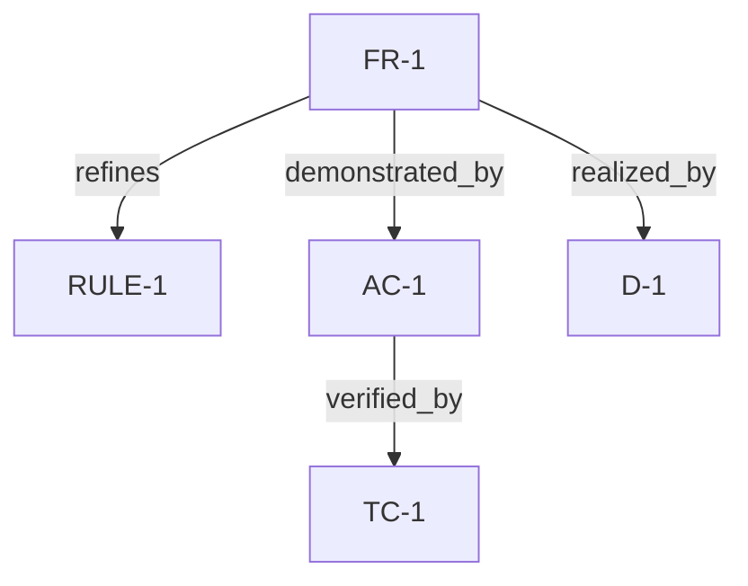

# Traceability Graph Reference

This reference defines Planning Forge traceability as a directed graph whose preferred nodes are stable IDs. It is a local reference, not an invocable skill.

Human-facing sections may render the graph as bullets, compact tables, or inline `Trace:` fields. The underlying model is typed edges. Do not require agents to manually store reverse edges; reverse questions are answered by traversing the same directed edges in the opposite direction.

Examples of reverse questions the graph must support:

- Which tests verify `FR-7`?
- Which requirements justify `TC-21`?
- Which decisions realize `RULE-3`?

## Node Rules

- Use stable IDs from `shared/stable-id-discipline.md` as graph nodes: `US-`, `RULE-`, `FR-`, `NFR-`, `INT-`, `AC-`, `EDGE-`, `ASM-`, `D-`, and `TC-`.
- Do not introduce new prefixes solely for traceability. Use the existing `## Goal` section as prose unless the stable-ID taxonomy later adds goal IDs. Use `D-` for architecture decisions unless the taxonomy later adds `ADR-`.
- Risks remain prose today. Reference a risk by short title text in a trace note only when needed; do not emit `RISK-` IDs.
- Prefer direct edges between stable IDs. Use prose nodes such as `Goal`, `In Scope`, a risk title, a manual/review check label, or a command label only when no stable ID exists yet.

## Edge Syntax

Use this canonical edge form wherever an output asks for traceability:

```text
<source> <relationship> <target>
```

Multiple edges may be separated by semicolons in a compact `Trace:` field:

```text
Trace: FR-1 refines RULE-1; FR-1 demonstrated_by AC-1.
```

When the current item is the target of a canonical edge, still keep the canonical direction:

```text
### TC-1: rejects duplicate trial requests
- Trace: AC-3 verified_by TC-1; FR-2 verified_by TC-1.
```

## Relationship Vocabulary

Use only these relationship names unless the user explicitly supplies an existing project vocabulary:

| Relationship | Meaning |
|--------------|---------|
| `derives_from` | Source was derived from target context, source artifact, or upstream item. |
| `satisfies` | Source satisfies target goal, need, story, or requirement. |
| `refines` | Source adds more specific behavior, detail, or implementation-ready shape to target. |
| `constrains` | Source limits, qualifies, or sets a quality bound on target. |
| `conflicts_with` | Source and target cannot both be true without resolution. Store once with a short reason. |
| `depends_on` | Source cannot be implemented, evaluated, or released independently of target. |
| `supersedes` | Source replaces target while preserving history. Use with ID change summaries when IDs change. |
| `realized_by` | Source requirement, rule, interface, acceptance criterion, or edge case is realized by target design decision. |
| `demonstrated_by` | Source user story, requirement, rule, edge case, or quality attribute is demonstrated by target acceptance criterion. |
| `verified_by` | Source acceptance criterion, requirement, edge case, decision, or risk is verified by target test case, manual check, review check, or command. |
| `mitigates` | Source decision, requirement, test, or control reduces target risk or failure mode. |

## Optional Mermaid Rendering

Mermaid diagrams are allowed only as derived views of the typed edge list. Do not make Mermaid the canonical traceability source, and do not put relationships in a diagram that are absent from the typed edges.

Generate a Mermaid view only when the user asks for one, or when the graph is small enough that the diagram improves review. For broad specifications, keep the typed edge list and omit the diagram by default.

Example derived view:



## Authoring Rules

- Prefer the fewest edges that preserve downstream accountability. Do not connect every item to every nearby item.
- Record the most meaningful relationship, not just adjacency. For example, use `FR-2 refines RULE-1`, not `FR-2 depends_on RULE-1`, when the FR exists to enforce that rule.
- Do not duplicate reverse edges such as both `FR-1 demonstrated_by AC-1` and `AC-1 demonstrates FR-1`. Use the canonical edge once.
- Keep traceability acyclic where possible. Cycles are allowed only for `conflicts_with` or explicitly mutual dependencies; call out the reason.
- If an edge is assumption-based, say so in the trace note rather than inventing missing upstream IDs.